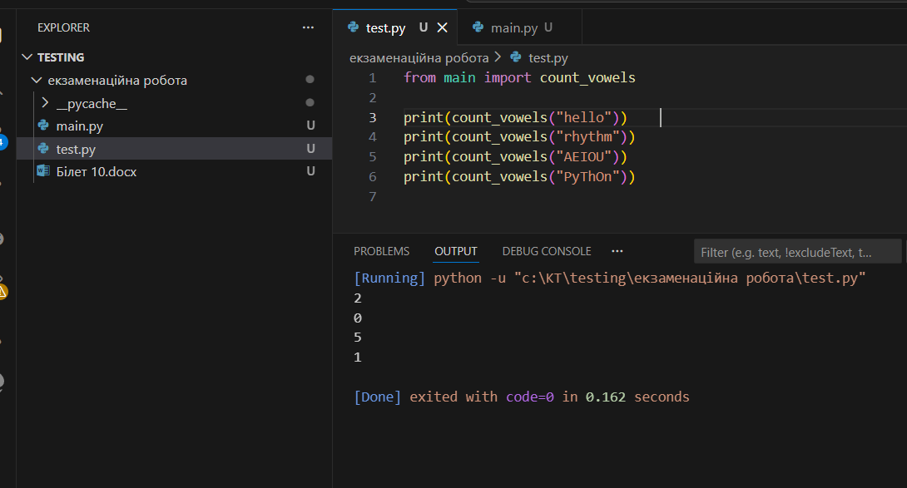

# Екзаменаційний білет 10 практичне завдання
Завдання: У файлі main.py створіть функцію count_vowels(text: str), яка рахує кількість голосних літер у рядку. Тест: У файлі test.py перевірте роботу функції на рядках з різною кількістю голосних, без голосних та у різному регістрі

## Приклад виконання
- запускаємо програму:
  ```bash
  python test.py
  ```
- запускаємо тести:
- результат
