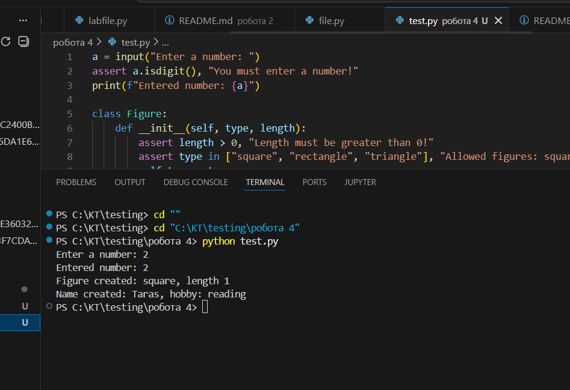
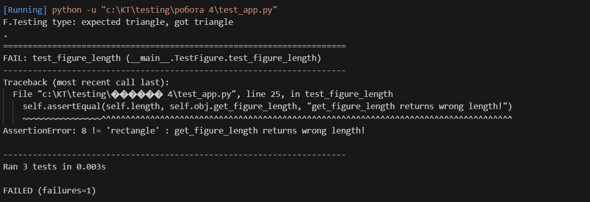
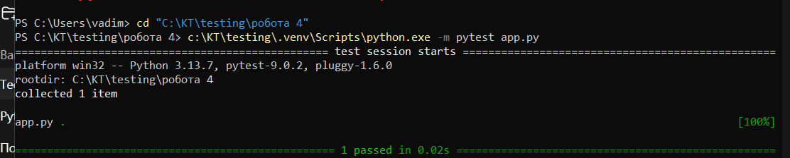
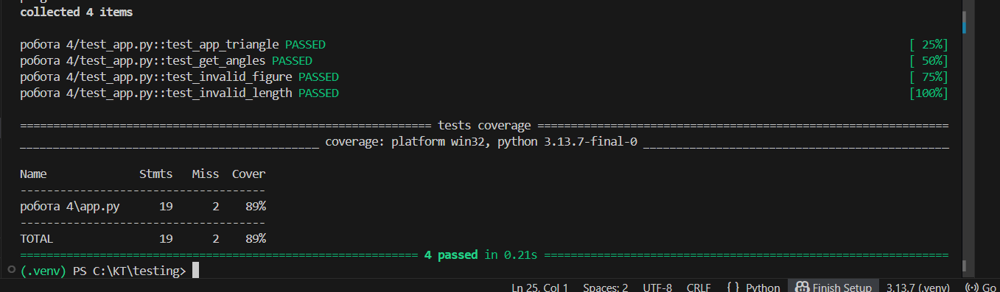
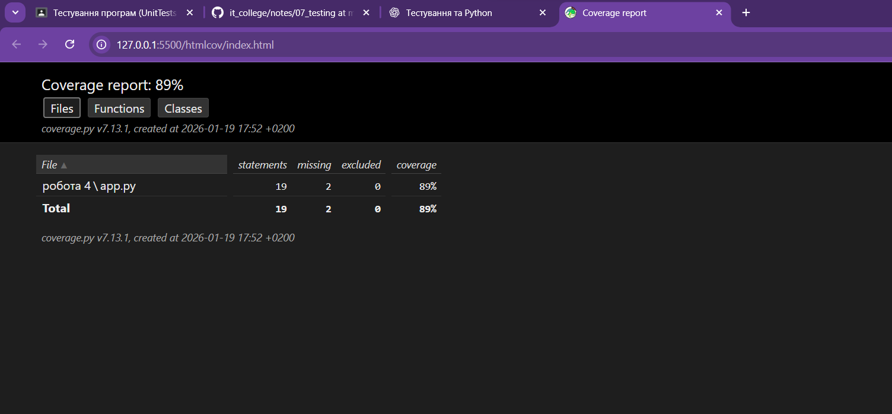

# Звіт до роботи
**Тема:** Основи тестування та юніт-тестів у Python  
**Мета роботи:** Навчитись створювати та виконувати юніт-тести з використанням `assert`, `unittest` та `pytest`, перевіряти коректність роботи класів і функцій, а також оцінювати покриття коду тестами (Coverage).

---
## Результати виконання завдання

1. Створено класи `Figure` та `Name` з валідацією даних у Python.  
2. Написано перевірки для введених даних з використанням `assert` та обробки помилок (`ValueError`).  
3. Розроблено та виконано юніт-тести за допомогою бібліотек **unittest** та **pytest**:  
   - Перевірка правильності створення об’єктів класів;  
   - Тести на недозволені значення та нульову довжину;  
   - Тестування методів класу, включно з розгалуженням (`get_angles`).  
4. Виконано тестування покриття коду за допомогою **pytest-cov**:  
   - Згенеровано текстовий та HTML-звіт;  
   - Проаналізовано покриття кожного рядка та розгалужень коду;  
   - Переконанося, що всі критичні функції класів покриті тестами.  
5. Програма та тести успішно виконуються у локальному середовищі Python з використанням **віртуального оточення (.venv)**, а результати тестів видно у терміналі та VS Code.  
6. Навченося:  
   - Налаштуванню середовища VS Code для роботи з Python та тестами;  
   - Виклику тестів через консоль та IDE;  
   - Інтеграції PyTest та Coverage для оцінки якості коду;  
   - Створенню звітів про покриття коду у форматі HTML для подальшого аналізу.  

* вставлені рисунки 
 
 
 
 
 

---

# Висновок до роботи

---

### 1. Що зроблено в роботі
У ході роботи було виконано наступне:  
- Створено приклади використання **assert** для перевірки коректності введених даних;  
- Розроблено класи `Figure` та `Name` з валідацією даних;  
- Створено та перевірено об’єкти класів з різними комбінаціями вхідних даних;  
- Використано бібліотеку **unittest** для написання юніт-тестів класу `Figure`;  
- Проведено практику з **pytest** для створення функціональних тестів;  
- Використано плагін **pytest-cov** для визначення покриття коду тестами та створено звіт у форматі HTML;  
- Додано розгалуження у класі `Figure` (метод `get_angles`) та протестовано їх покриття тестами.  

Всі приклади коду та тести виконувалися у локальному середовищі Python з використанням віртуального оточення.

---

### 2. Чи досягнуто мети роботи
Мета роботи була досягнута повністю:  
- Було навченося створювати та запускати юніт-тести, перевіряти роботу класів і функцій;  
- Було оцінено покриття коду тестами;  
- Вдалося виявити та продемонструвати помилки у коді через тестування.  

---

### 3. Які нові знання отримано
- Принципи використання `assert` для перевірки правильності даних;  
- Основи роботи з класами та валідацією аргументів у Python;  
- Написання юніт-тестів за допомогою `unittest` та `pytest`;  
- Використання плагіна `pytest-cov` для аналізу покриття коду тестами;  
- Розуміння роботи розгалужень у коді та їх тестування;  
- Практичний досвід запуску тестів через консоль та IDE (VS Code).  

---

### 4. Чи вдалося відповісти на всі питання, задані в ході роботи
Так, усі запитання щодо створення тестів, перевірки класів та функцій, а також оцінки покриття коду були детально опрацьовані.

---

### 5. Чи вдалося виконати всі завдання
Так, всі завдання виконані повністю:  
- Написані приклади з `assert`;  
- Створені класи та об’єкти;  
- Реалізовані юніт-тести з `unittest` і `pytest`;  
- Зроблений аналіз покриття коду та згенерований HTML-звіт.

---

### 6. Чи виникли складності у виконанні завдання
Були незначні складності при:  
- Встановленні та налаштуванні сторонніх бібліотек (`pytest`, `pytest-cov`) у Windows;  
- Виклику тестів у віртуальному середовищі через PowerShell.  

Всі проблеми були швидко вирішені шляхом використання `python -m pytest` для запуску тестів.

---

### 7. Чи подобається такий формат здачі роботи
Так, формат інтеграції коду, тестів та покриття у одному проєкті є зручним. Використання PyTest та Coverage дозволяє наочно бачити результат тестування та ефективність покриття коду.

---

### 8. Побажання для покращення
Було б корисно додати:  
- Більше практичних прикладів з різними видами тестів (розгалуження, винятки, неправильні дані);  
- Поради щодо автоматизації запуску тестів та звітів у командному рядку;  
- Візуалізацію покриття коду безпосередньо у середовищі розробки для швидкого аналізу результатів.
